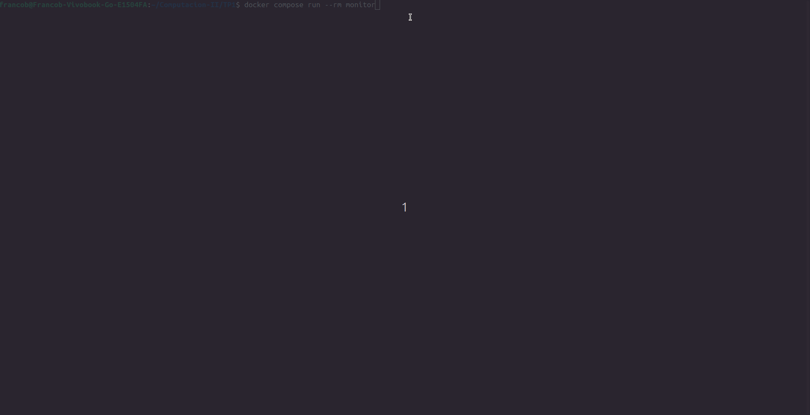

# Trabajo Práctico Nº 1: Monitor de Procesos 

**Alumno:** Franco Luciano Berardo
**Materia:** Computación II 
---

## 1. Descripción General
Este proyecto es un monitor de recursos del sistema en tiempo real, similar a `htop`. Lee directamente la información expuesta por el kernel de Linux en el sistema de archivos virtual `/proc`. Cuenta con una interfaz gráfica en consola (TUI) interactiva que permite navegar entre 7 vistas diferentes (Resumen, Memoria, FDs, Threads, Señales, Scheduling y Sistema Global), filtrar procesos por usuario/comando, ordenarlos al vuelo y modificar la velocidad de refresco de cada hilo de lectura de manera independiente.

---

## 2. Diagrama de Arquitectura

La arquitectura se basa en un proceso central que orquesta la lectura delegando el trabajo pesado a múltiples procesos hijos paralelos.

```text
                                  [Teclado / TUI]
                                   (Threading)
                                        │
┌───────────────────────────────────────▼─────────────────────────────────────┐
│                           MEMORIA COMPARTIDA                                │
│                                                                             │
│  - snapshot (Manager.dict): { "resumen": {...}, "memoria": {...}, ... }     │
│  - intervalos (Value): { "1": 2.0, "2": 3.0, "3": 5.0, ... }                │
└─▲─▲─▲─▲─▲─▲─▲───────────────────────────────────────────────────────────────┘
  │ │ │ │ │ │ │   (Lectura y Escritura)
  │ │ │ │ │ │ │
  │ │ │ │ │ │ └──► Proceso Analizador: Sistema Global (/proc/stat, /proc/meminfo)
  │ │ │ │ │ └────► Proceso Analizador: Scheduling (/proc/<pid>/stat)
  │ │ │ │ └──────► Proceso Analizador: Señales (/proc/<pid>/status)
  │ │ │ └────────► Proceso Analizador: Threads (/proc/<pid>/task)
  │ │ └──────────► Proceso Analizador: FDs (/proc/<pid>/fd)
  │ └────────────► Proceso Analizador: Resumen (/proc/<pid>/stat, status)
  └──────────────► Proceso Analizador: Memoria (/proc/<pid>/status, /proc/<pid>/maps)

```

---

## 3. Decisiones de Diseño Argumentadas

¿Por qué elegiste tal mecanismo de IPC y no otro?
Se optó por utilizar memoria compartida en lugar de pasaje de mensajes (como Queue o Pipe). Al tener 7 analizadores generando datos constantemente y una TUI que necesita leer el estado global a 5 FPS para ser fluida, llenar y vaciar colas iba a generar un cuello de botella enorme. Compartir el estado en un diccionario permite que la interfaz simplemente lea la "foto" más reciente (snapshot) sin bloquearse.

¿Por qué Manager y no Value/Array para algunas cosas?
El snapshot global contiene estructuras de datos anidadas y de tamaño dinámico (diccionarios dentro de diccionarios, ya que la cantidad de PIDs varía todo el tiempo). Value y Array solo soportan tipos de datos simples de C (enteros, floats). Por lo tanto, usamos multiprocessing.Manager().dict() para los datos de los procesos, y reservamos los multiprocessing.Value('d', ...) estrictamente para los intervalos de refresco (que son simples números flotantes).

¿Cómo manejaste las race conditions?
Al utilizar Manager().dict(), Python maneja por debajo un sistema de locks (proxies) que previene la corrupción de la estructura principal. Además, la arquitectura está diseñada de forma aislada: el analizador de Memoria solo escribe en la clave snapshot["memoria"], el de FDs en snapshot["fds"], etc. Al no haber múltiples escritores pisando la misma clave exacta del diccionario, evitamos inconsistencias lógicas.

¿Por qué los intervalos elegidos por defecto?
Están escalonados según el costo de I/O. La vista de Sistema y Resumen refrescan rápido (2s) porque leer el /proc/stat principal es barato. Sin embargo, la vista de File Descriptors está en 5s porque tiene que iterar sobre el directorio /fd de cada proceso activo, lo cual genera miles de lecturas al disco virtual, y si se hace muy rápido dispara el uso de CPU del propio monitor.

---

## 4. Conceptos del Curso Aplicados
Multiprocessing vs Threading: Se aplicó el concepto de que para tareas pesadas de I/O y parseo (leer cientos de archivos en /proc) convenía aislar la carga en procesos (multiprocessing.Process) para evitar el cuello de botella del GIL de Python. En cambio, para capturar la entrada del usuario (tty.setcbreak), usamos un hilo (threading.Thread) ya que simplemente espera I/O del teclado y no requiere procesamiento pesado.

Señales (Signals) y Async-Signal-Safety: Se implementó el manejo de señales POSIX (SIGINT, SIGTERM, SIGUSR1, etc.) aplicando el patrón self-pipe visto en la Clase 6. Para evitar race conditions o bloqueos al interrumpir el flujo principal, los handlers únicamente escriben un byte en un pipe no bloqueante y retornan inmediatamente. El hilo principal lee este pipe de forma segura y ejecuta las rutinas pesadas, como el apagado limpio (terminando a los hijos con un deadline razonable) o el volcado del estado a un archivo dinámico dump_<timestamp>.json.

---

## 5. Limitaciones Conocidas
Lectura de permisos: Muchos procesos del sistema (como los kernel threads) o de otros usuarios no exponen todos sus datos (ej. descriptores de archivos o entorno) si el monitor no se ejecuta con permisos de root.

Entorno Docker y TUI: Docker Compose captura el stdin y formatea el stdout de una manera que rompe las interfaces de consola interactivas basadas en secuencias de escape ANSI.

---

## 6. Cómo correr y testear
Para cumplir con los requerimientos del entorno, el sistema se construye y levanta utilizando el comando estándar: 

```bash
docker compose up --build
```

Aclaración sobre la ejecución: El apagado limpio con Ctrl+C (SIGINT) ya está implementado y funciona mandándolo desde Docker Compose. El tema es que si levantamos el proyecto con docker compose up, Docker te inyecta obligatoriamente el prefijo (monitor-1 |) en la consola y eso rompe todo el dibujo de la interfaz gráfica.
Por eso, para que se pueda probar bien la interactividad, usar los atajos del teclado y ver las tablas sin que Docker ensucie la pantalla, lo ideal es levantar la terminal directamente con:

```bash
docker compose run --rm monitor
```

Para probar el volcado de memoria (SIGUSR1):

 1.Con el monitor corriendo, abrir otra terminal.
 2.Identificar el contenedor y mandarle la señal:

 ```bash
 docker kill --signal=SIGUSR1 $(docker ps -q -f ancestor=tp1-monitor)
 ```

 3.Revisar que se haya creado el archivo dump_<timestamp>.json en el directorio host.  

---

## 7. Gif del monitor funcionando 

---


## 8. Decisiones sobre la TUI (Librería y Layout)
Se eligió la librería rich por sobre curses. rich facilita inmensamente el renderizado de tablas dinámicas con alineaciones y colores en un "Live buffer". Esto permite redibujar la pantalla de forma completa en el buffer alternativo de la terminal (screen=True) sin causar el clásico parpadeo (flicker) al limpiar la consola.

***